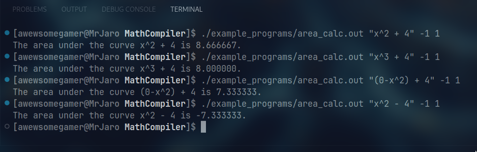

# Examples

The examples can be made using the command `make examples`.

## The Area Calculator (./example_programs/area_calc.c)
### REQUIRES: Doesn't require any external libraries

This program uses three inputs:
* `Expression` - The expression to calculate the area under (Uses variable: `x`)
* `From` - The from part of the interval ([`from`, to])
* `To` - The to part of the interval ([from, `to`])

The way to call the executable is: `area_calc.out "x" -1 1`.

This will return the area under the given `expression: "x"` within the interval [`from: -1`, `to: 1`].

Demonstration picture:

## The Visualizer (./example_programs/the_visualizer.c)
### REQUIRES: SDL2

This program uses two inputs:
* `Expression` - The expression to be visualized (Uses variables: `x`, `y`, `t`)
* `Time Interval` - The double at which the variable `t` (time) should be incremented / frame

The way to call the executable is `the_visualizer.out "x / y / t" 0.001`.

This will open a 640x480 32-bit RGB color window, where the variable `t` will be incremented by `0.001`, and the color and position of each pixel be influenced by `expression: "x / y / t"`.

Demonstration video available <a href="https://www.youtube.com/watch?v=2YqrAQ_BL9o" target="_blank">here</a>.

## Graphing Calculator (./example_programs/graphing_calculator.c)
### REQUIRES: SDL2

This program uses three inputs:
* `Expression` - The expression to plot (Uses variables: `x`, `t`)
* `Granularity` - The smaller the value, the closer the points (smoother line)
* `Time Interval` - The double at which the variable `t` (time) should be incremented / frame

The way to call the executable is: `graphing_calculator "x^2" 0.0001 0.1`

This will open a 640x480 32-bit RGB color window, and plot in white `expression: "x^2"` with a `granularity` of `0.0001` and increment the variable `t` (time) by 0.1 every frame.

Demonstration video available <a href="https://www.youtube.com/watch?v=Cog0kFnWwTM" target="_blank">here</a>.